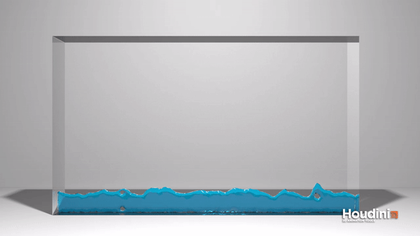

# Fluid Simulator (Name TBD)




## Overview
Wave is a smoke and fluid simulator based on the algorithms presented by Robert Bridson in both his book and Siggraph course notes. 

## Advection


## How to Run
```
// Build program
mkdir build
cd build
cmake ..
make

// Run program
cd ..
cd src
./SIM <fluid or smoke>
```

**To change to 3D Fluid**
- In `main.cpp` comment out `#define TWO_DIM`

## References
- [Siggraph 2007 Course Notes](https://www.cs.ubc.ca/~rbridson/fluidsimulation/fluids_notes.pdf)
- [Aline Normoyle's Tutorial](http://www.alinenormoyle.com/TutorialFluid.html)
- [Stable Fluids by Stam](http://www.dgp.toronto.edu/people/stam/reality/Research/pdf/ns.pdf)
- [Visual Simulation of Smoke by Fedkiw, Stam, & Jensen](http://physbam.stanford.edu/~fedkiw/papers/stanford2001-01.pdf)
- [Fluid Simulation for Computer Graphics by Braley and Sandu](http://users.encs.concordia.ca/~grogono/Graphics/fluid-5.pdf)
- [PIC/FLIP Using a Block-Optimized Grid Data Structure](https://www.diva-portal.org/smash/get/diva2:441801/FULLTEXT01.pdf)
- [3D Particle in Cell/Fluid Implicit Solver Thesis by Ioannidis](https://nccastaff.bournemouth.ac.uk/jmacey/MastersProjects/MSc12/Ioannidis/Thesis.pdf)
- [Fluid Flow for the Rest of Us by Cline, Cardon, and Egbert](https://pdfs.semanticscholar.org/9d47/1060d6c48308abcc98dbed850a39dbfea683.pdf)
